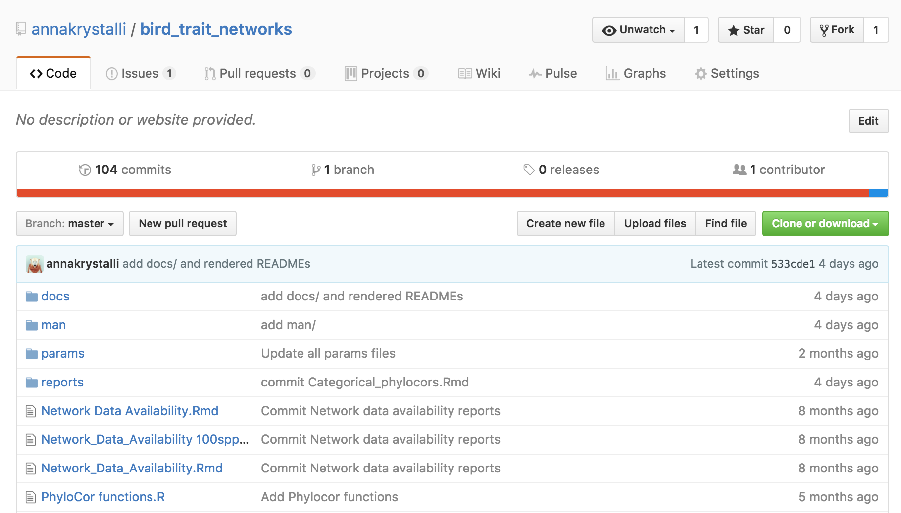
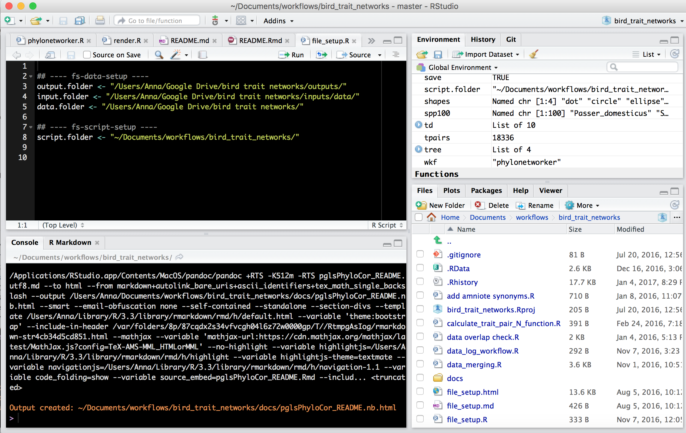
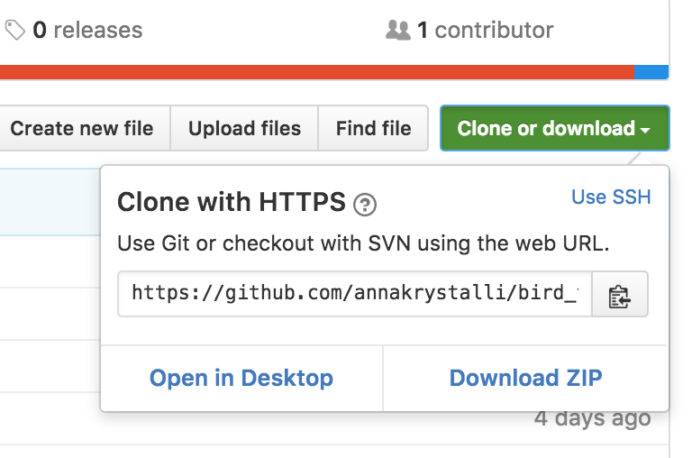

```{r setup, include=TRUE, echo=FALSE, message=FALSE, warning=FALSE}
require(knitr)
require(rmarkdown)
knitr::opts_chunk$set(echo = TRUE, root.dir = "~/Documents/workflows/bird_trait_networks/")
knitr::read_chunk("~/Documents/workflows/bird_trait_networks/file_setup.R")
```

***

<br>

This README documents the scripts contained in the github repo and demonstrates their use to conduct analyses relating to the **bird trait networks project**. 

Description is split into project set up and the various analyses attempted during the project.

# **Project setup**

<br>

## **get access to code:**

The ideal method to access the code is the through [**checking it out**](http://www.molecularecologist.com/2013/11/using-github-with-r-and-rstudio/) from the master [**github folder**](https://github.com/annakrystalli/bird_trait_networks). It is worth spending on time to set this up properly so here's more on [**github through Rstudio**](https://annakrystalli.github.io/Mozfest_github-rstudio/index.html), [setting yourself up on github and Rstudio](https://github.com/mikecroucher/ISBE_Symposium) and [forking & linking projects through RStudio](https://annakrystalli.github.io/Mozfest_github-rstudio/evolottery.html)



You can create a static local implementation of the project by just downloading the github repo as a ZIP: 



unzipping it and supplying the **path to the unzipped folder** to parameter `script.folder`. You will not be able to automatically update code with changes to the master repo however so not recommended.

<br>

## **configure project - edit `file_setup.R`**

To initiate a project locally, the first thing to do is edit script [**`file_setup.R`**](https://github.com/annakrystalli/bird_trait_networks/blob/master/file_setup.R) to **specify the paths to:**

### 1. Folder containing the data (the googledrive folder)

The best way to access the data is through authorised access through googledrive. You'll need to [install googledrive on your system](https://www.google.com/intl/en-GB/drive/download/) to enable this. 


Once installed, you'll be able to programmatically access files (see example below), by specifying your local path to the folder.  Analyses will also always be synched to most up to date version of data.

```{r fs-data-setup}

```

<br>

### 2. Folder containing the code (the github folder)

Ideally it is the ***path to an Rstudio project, [checked out](http://www.molecularecologist.com/2013/11/using-github-with-r-and-rstudio/) from the master [github folder](https://github.com/annakrystalli/bird_trait_networks)*** 


```{r fs-script-setup}

```
<br>

## **set up file.system**
set path to `file_setup.R` script and source
```{r}
file_setup_path <- "~/Documents/workflows/bird_trait_networks/file_setup.R"
source(file_setup_path)
```


<br>

***

# **initialise an analysis environment.** 

<br>

## **specify environment**

Specify environment through setting `"param"` or `"wkf"`. 

 - `param` should a character string of the **name of a script in `params/` folder**. Use this folder to store parametarisations of the environment to be called. 
 - `"wkf"` specifies the workflow you wish to load in the environment

e.g.
```{r}
wkf = "phylonetworker"
param = "phylonetworker.R"
```


*if no `"param"` or `"wkf"` is specified*, sourcing `project_ui.R` initalises a **base global envrionment.** 


## **source `project_ui.R`**


```{r, eval=FALSE, echo=TRUE}
source(paste(script.folder, "project_ui.R", sep = ""))
```

#### see [**project_ui README**](http://annakrystalli.github.io/bird_trait_networks/project_ui.nb.html) for more

***
#### Workflows (`"wkf"`) within the project

- #### [**`rmacroRDM`**](http://annakrystalli.github.io/bird_trait_networks/rmacroRDM.nb.html): 
Addition of the **amniote database** to originally supplied data. Outputs, long and aggregated wide versions of the data. Current analysis in [**`"master workflow.R"`**](https://github.com/annakrystalli/bird_trait_networks/blob/master/match%20workflow.R) 

***

- #### [**`phylonetworker`**](http://annakrystalli.github.io/bird_trait_networks/PhyloNetworker_README.nb.html): 
network analysis of phylogenetically corrected correlation between traits, current analysis in [**`"PhyloNeworker.R"`**](https://github.com/annakrystalli/bird_trait_networks/blob/master/PhyloNetworker.R)

***

- #### [**`mgm`**](http://annakrystalli.github.io/bird_trait_networks/mgm.html): 
network analysis of mgm derived associations of trait marginal relationship, performed on imputed data. Current analysis in [**`"mgm.R"`**](https://github.com/annakrystalli/bird_trait_networks/blob/master/mgm.R). Use [`reports/results/mgm_viz.Rmd`](https://github.com/annakrystalli/bird_trait_networks/blob/master/docs/mgm_viz.nb.html) to [visualise anaysis](http://annakrystalli.github.io/bird_trait_networks/mgm_viz.nb.html)

***

- #### [**`goodmankruskal`**](http://annakrystalli.github.io/bird_trait_networks/GoodmanKruskal.nb.html): 
  goodmanKruskal τ determination (GKtau)  on categorical variables and network analysis of outputs. current analysis in [**`"goodmankruskal.R"`**](https://github.com/annakrystalli/bird_trait_networks/blob/master/goodmankruskal.R)

***

#### Other useful documents

- #### [**`data_gap_eval.Rmd`**](http://annakrystalli.github.io/bird_trait_networks/data_gap_eval.nb.html): 
Evaluation of data avalaibility and resulting biases.
- #### []